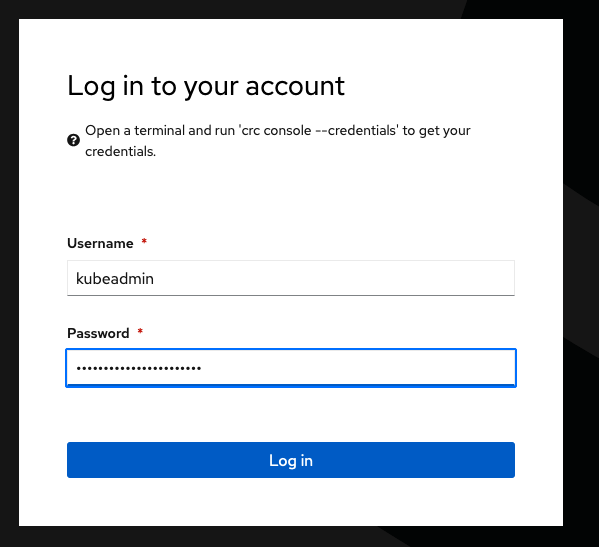
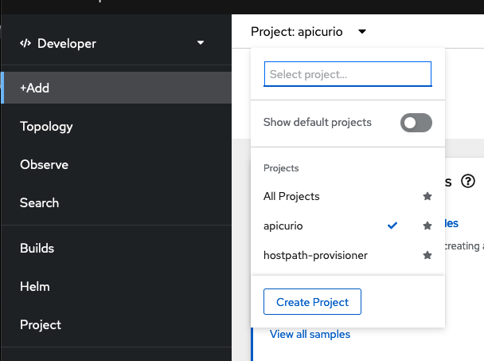
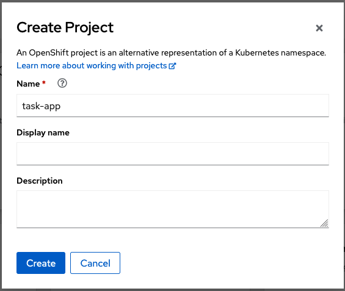
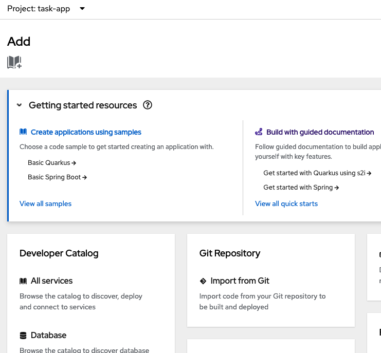
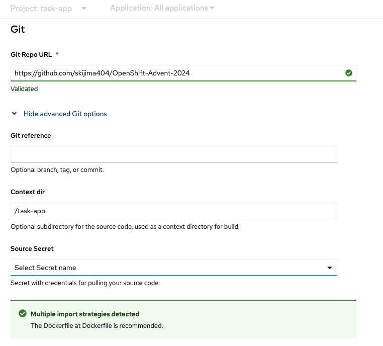
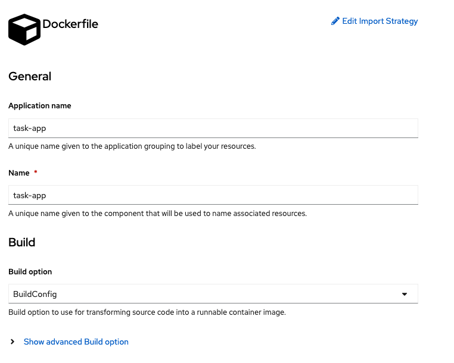
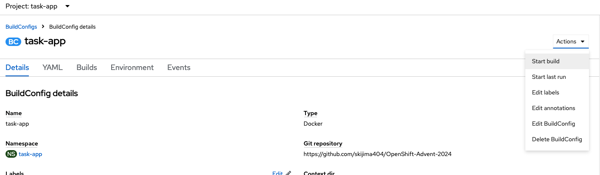

# タスクアプリをデプロイ

さてタスクアプリのデプロイ手順を聞いてみる。

> これをGithubにPushした後、OpenShift LocalにはGithubを参照してもらおうかと思います。
> GUIを使ってデプロイする方法をStep by Stepで教えていただけますか。

でたものを修正。

> リポジトリですが
> 
> https://github.com/skijima404/OpenShift-Advent-2024
> 
> task-appは
> 
> https://github.com/skijima404/OpenShift-Advent-2024/tree/main/task-app
> 
> にあります。これを加味して修正いただけますか。

この手順の通りやってみる。

## Step 1: Githubリポジトリのパス確認

パスの確認のみ。

## Step 2: OpenShift LocalのWebコンソールにアクセス

OpenShift Localにkubeadminでログイン

## Step 3: プロジェクトを作成

## Step 4: GitHubリポジトリからデプロイ

作成したプロジェクトが自動的に選ばれていることを確認してリポジトリからインポート。

でcreateボタン。

エラーでこけた。

> STEP 3/6: COPY ${JAR_FILE} app.jar
> error: build error: building at STEP "COPY ${JAR_FILE} app.jar": checking on sources under "/tmp/build/inputs/task-app": copier: stat: "/target/task-api.jar": no such file or directory

ChatGPTに聞いてdockerfileを修正。
再度 Start Build。

同じエラーが出たので、再確認。BuildConfigのStrategyを確認しろと。
画面上になさそうなので再設定なんだけど、これ後から設定画面が見当たらない。
コマンド好きじゃないなあ。
削除してやり直しましょう。

<途中経過記録なし>

結局11回目のデプロイでやっと成功、Podがクラッシュするので最終的にSpring Boot 2.x から3.2にアップグレードしてようやく動作確認。
全てdockerfileとpom.xmlの書き直し。

[rested](./images/4-8.png)

